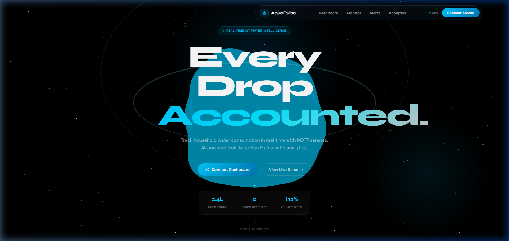
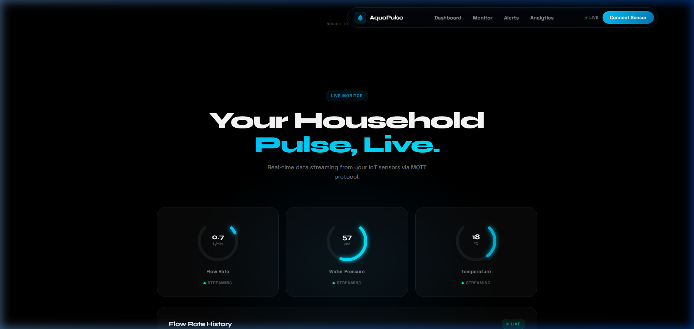
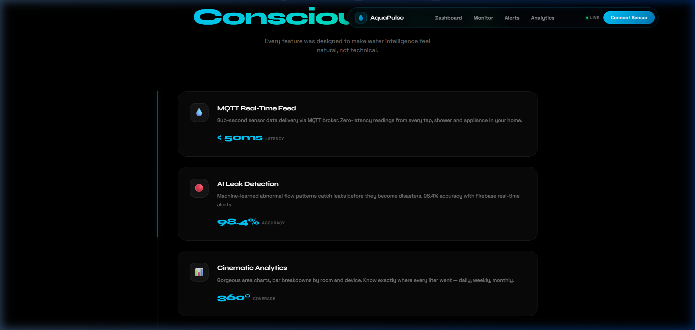

# 💧 AquaPulse: Smart Water Usage Monitor

[](https://aquapulse-hrk7jcpax-abhinavv27s-projects.vercel.app/)
[](https://opensource.org/licenses/MIT)
[](https://reactjs.org/)
[](https://threejs.org/)

> **Every drop, intelligently tracked.** A high-fidelity, futuristic IoT dashboard for real-time household water consumption monitoring.

---

## ✨ Live Experience

🚀 **Check it out here:** [AquaPulse Live Dashboard](https://aquapulse-hrk7jcpax-abhinavv27s-projects.vercel.app/)

---

## 📸 Check it Out

### 🌊 Cinematic Hero

*The interactive 3D water sphere serves as the heartbeat of your home monitoring.*

### 📊 Live Analytics Dashboard

*Real-time SVG gauges and flow-rate charts powered by simulated MQTT streams.*

### 🛠️ Feature Timeline

*Scroll-pinned feature cards explaining the core intelligence of AquaPulse.*

---

## 🚀 Key Features

### 🌌 Cinematic 3D Experience
- **Interactive Water Sphere:** A breathing, organic 3D model built with `React Three Fiber` and `MeshDistortMaterial`.
- **Orbital Data Rings:** Visual representation of data flow cycles in a 3D space.
- **Starfield Background:** 600+ dynamic particles creating a "space-age" atmosphere.

### 📡 Real-Time IoT Integration
- **MQTT Protocol:** Sub-second sensor data delivery simulation for multi-device tracking.
- **Live Gauges:** Custom SVG ring gauges for flow rate, pressure, and temperature.
- **Dynamic Charts:** Glowing area charts for historical usage analysis using `Recharts`.

### 🚨 Smart Alert System
- **Anomaly Detection:** AI-simulated logic to distinguish between normal usage and potential leaks.
- **Interactive Simulation:** A "Simulate Leak" button that triggers a critical red UI state and push-style notifications.

### 💨 High-End UX
- **Cinematic Scrolling:** Integrated with **Lenis** for buttery-smooth, inertia-based navigation.
- **Glassmorphism:** Premium UI components with ultra-blurred backgrounds and glowing borders.
- **Responsive Motion:** Powered by **Framer Motion** for staggered reveals and parallax effects.

---

## 🛠️ Tech Stack

- **Framework:** React 18 + Vite
- **3D Engine:** Three.js / @react-three/fiber
- **Animations:** Framer Motion / GSAP / Lenis
- **Data Viz:** Recharts
- **Communication:** MQTT (Simulated via async ticks)
- **Deployment:** Vercel Global Edge

---

## 📦 Installation

1. **Clone the repo**
   ```bash
   git clone https://github.com/abhinavv27/AquaPulse.git
   cd AquaPulse
   ```

2. **Install dependencies**
   ```bash
   npm install
   ```

3. **Launch the engine**
   ```bash
   npm run dev
   ```

---

## 🗺️ Project Structure

```text
src/
├── components/          # High-fidelity UI & 3D Components
│   ├── HeroCanvas.jsx   # Three.js Scene logic
│   ├── LiveMonitor.jsx  # IoT Gauge & Charting logic
│   ├── AlertSystem.jsx  # Smart notification system
│   └── ...
├── App.jsx              # Smooth scroll & Layout setup
└── index.css            # Global Design Tokens & Glassmorphism utilities
```

---

## 🌿 Future Roadmap

- [ ] **Phase 1:** Native Mobile App via React Native.
- [ ] **Phase 2:** Physical ESP32 Sensor Hardware Integration.
- [ ] **Phase 3:** Predictive Water Bill Forecasting using LSTMs.


