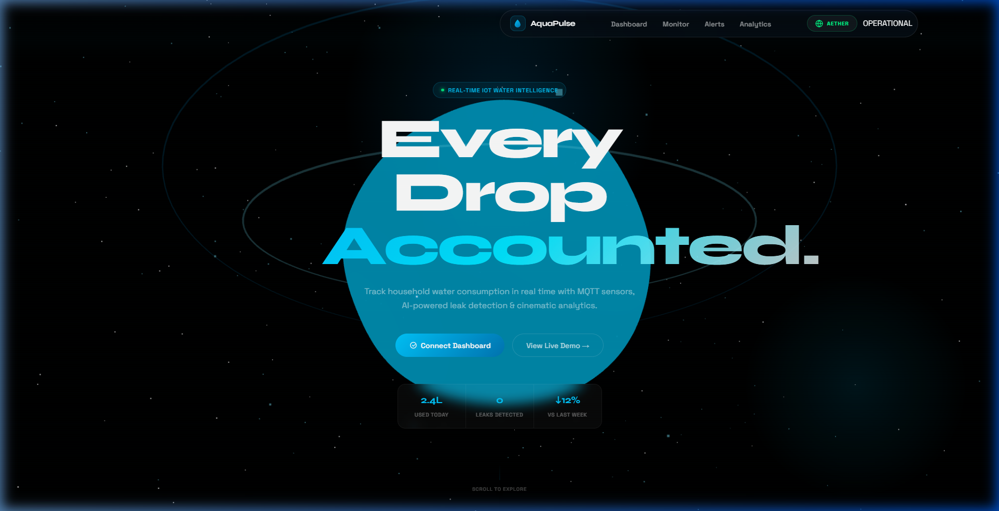
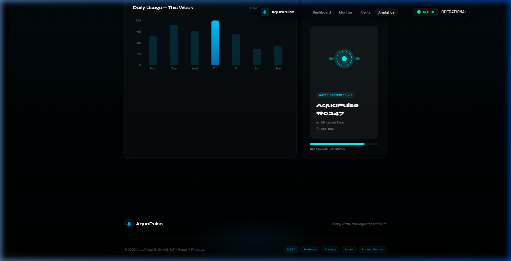
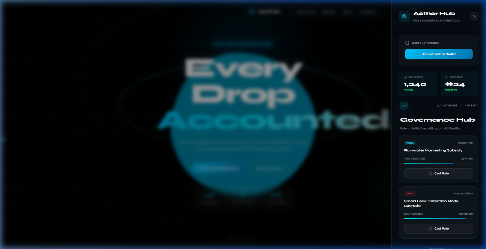
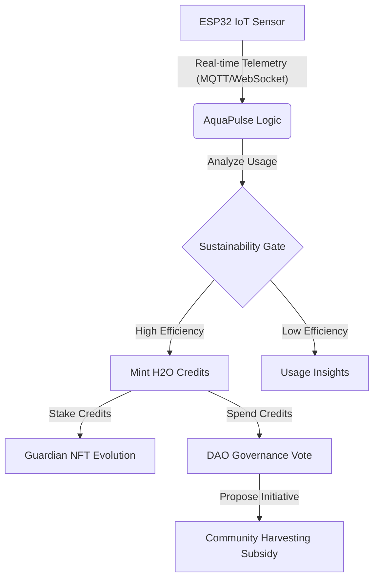

# 🏛️ AquaPulse: The Aether Protocol (v2.5)
### *Next-Gen IoT Water Intelligence meets Web3 Sustainability Governance*

AquaPulse has evolved beyond a simple dashboard into a **decentralized smart home protocol** designed to transform conservation into a high-fidelity digital ecosystem. By bridging physical IoT sensors with the **Aether Sustainability Layer**, users are rewarded for their ecological impact through a unique "Monitoring-to-Evolve" cycle.

---

## 💎 The Aether Protocol: Key Pillars

### 1. 🌊 Kinetic IoT Intelligence
- **Real-Time Telemetry**: Seamless integration with ESP32/ESP8266 hardware for volumetric flow monitoring.
- **Interactive Glow-Maps**: Our high-fidelity "Glow-Grid" provides tactical feedback for usage trends.
- **EcoPulse Detection**: Rhythmic visual signals that pulse when your household achieves peak sustainability.

### 2. 🧬 Generative "Water Guardian" NFTs

- **Sustainability-Scaled Evolution**: Your Guardian NFT isn't static. It procedurally evolves its form, color, and aura based on your weekly Eco Score.
- **Proof-of-Conservation**: Each Guardian acts as a decentralized badge of your commitment to the Aetheris Protocol.

### 3. 🗳️ DAO Governance & H2O Credits

- **H2O Utility Engine**: Earn credits through efficient usage and use them to power community-wide initiatives.
- **Decentralized Voting Interface**: Participate in the "Aether Hub" to vote on local harvesting subsidies, infrastructure upgrades, and sustainability bounties.

---

## 📊 System Architecture & Data Flow

### 🔄 The Protocol Lifecycle

### 📈 Scalability & Network Load
| Tier | Node Type | Capacity | Consensus Role |
| :--- | :--- | :--- | :--- |
| **Exosphere** | Full Validator | 10k+ Queries/s | Global Governance |
| **Stratosphere** | Regional Node | 5k Queries/s | Local Subsidy Voting |
| **Troposphere** | User Node (IoT) | Real-time Stream | Data Validation |

---

## 🛠️ Architecture & High-Tech Stack

### 🧩 Core Infrastructure
- **Frontend Engine**: React 18 & Vite (Optimized for ultra-low latency)
- **Cinematic UX**: Framer Motion & Three.js (High-fidelity 3D/interactivity)
- **Web3 Protocol**: Aetheris Node Simulation & Procedural SVG Generation
- **Hardware Abstraction**: Dual-stream MQTT/WebSocket support for ESP32/ESP8266

---

## 🚀 Experience the Protocol
1. **Connect**: Link your Aether Node via the top-right hub.
2. **Sync**: Register your physical sensors for real-time telemetry.
3. **Govern**: Stake your H2O credits in the DAO to shape the future of urban water conservation.

---

### 🌐 Deployment
[Check it Out Live on Vercel](https://aquapulse-eight.vercel.app/)

---
*Developed by the **Advanced Agentic Coding (Antigravity)** team at Google DeepMind.*
